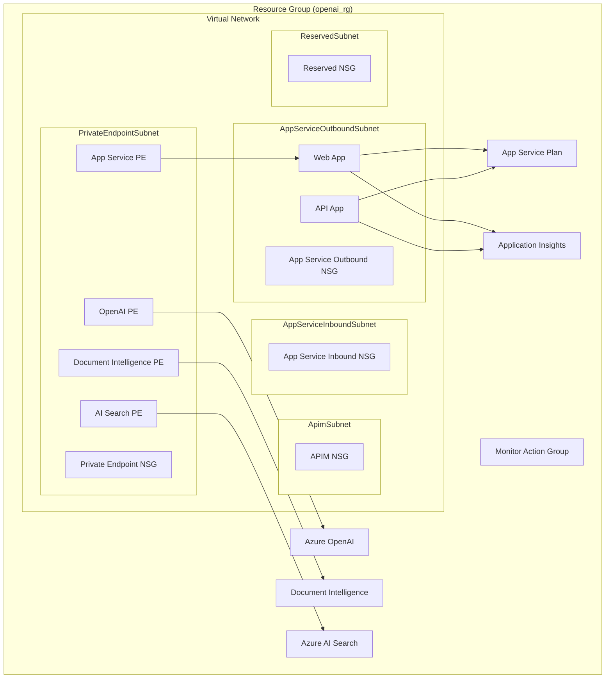

# Terraform Verified Pattern Module for OpenAI Cognitive Search

This codebase provisions and configures Azure resources using Terraform for an OpenAI Cognitive Search pattern. It focuses on deploying Azure OpenAI Search and Document Intelligent services, Cognitive Account, and Azure Web Apps as the front end to the OpenAI services.

## Features:
- Automated creation of Azure Resource Groups, Virtual Networks, and Network Security Groups.
- Deployment of Azure OpenAI services and Cognitive Search.
- Configuration of private endpoints for secure access to OpenAI services.

## Example
```terraform
resource "azurerm_resource_group" "this" {
  location = "CanadaCentral"
  name     = "rg-avm-ptn-openai"
}

module "example" {
  source              = "../../"
  location            = azurerm_resource_group.this.location
  name                = "avmptnopenai-default"
  resource_group_name = azurerm_resource_group.this.name
  enable_telemetry    = var.enable_telemetry
}
```

## Architecture Diagram


> [!IMPORTANT]
> As the overall AVM framework is not GA (generally available) yet - the CI framework and test automation is not fully functional and implemented across all supported languages yet - breaking changes are expected, and additional customer feedback is yet to be gathered and incorporated. Hence, modules **MUST NOT** be published at version `1.0.0` or higher at this time.
>
> All module **MUST** be published as a pre-release version (e.g., `0.1.0`, `0.1.1`, `0.2.0`, etc.) until the AVM framework becomes GA.
>
> However, it is important to note that this **DOES NOT** mean that the modules cannot be consumed and utilized. They **CAN** be leveraged in all types of environments (dev, test, prod etc.). Consumers can treat them just like any other IaC module and raise issues or feature requests against them as they learn from the usage of the module. Consumers should also read the release notes for each version, if considering updating to a more recent version of a module to see if there are any considerations or breaking changes etc.
