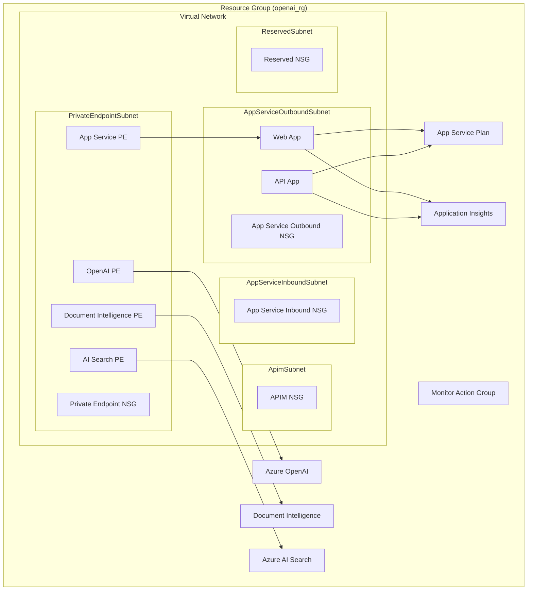

```mermaid
flowchart TB
    %% Main Resource Group container
    subgraph RG["Resource Group (openai_rg)"]
        %% Virtual Network with all subnets
        subgraph VNET["Virtual Network"]
            %% APIM Subnet
            subgraph APIM_SUBNET["ApimSubnet"]
                APIM_NSG["APIM NSG"]
                %% APIM["API Management"] %% Commented out in the code
            end
            
            %% App Service Inbound Subnet
            subgraph ASI_SUBNET["AppServiceInboundSubnet"]
                ASI_NSG["App Service Inbound NSG"]
            end
            
            %% App Service Outbound Subnet
            subgraph ASO_SUBNET["AppServiceOutboundSubnet"]
                ASO_NSG["App Service Outbound NSG"]
                WEBAPP["Web App"]
                APIAPP["API App"]
            end
            
            %% Private Endpoint Subnet
            subgraph PE_SUBNET["PrivateEndpointSubnet"]
                PE_NSG["Private Endpoint NSG"]
                OPENAI_PE["OpenAI PE"]
                DOCINT_PE["Document Intelligence PE"]
                SEARCH_PE["AI Search PE"]
                APP_PE["App Service PE"]
            end
            
            %% Reserved Subnet
            subgraph RES_SUBNET["ReservedSubnet"]
                RES_NSG["Reserved NSG"]
            end
        end
        
        %% Standalone resources
        APP_PLAN["App Service Plan"]
        
        OPENAI["Azure OpenAI"]
        DOC_INT["Document Intelligence"]
        SEARCH["Azure AI Search"]
        
        APP_INSIGHTS["Application Insights"]
        ACTION_GROUP["Monitor Action Group"]
    end

    %% Connections between resources
    WEBAPP --> APP_PLAN
    APIAPP --> APP_PLAN
    APP_PE --> WEBAPP
    OPENAI_PE --> OPENAI
    DOCINT_PE --> DOC_INT
    SEARCH_PE --> SEARCH
    WEBAPP --> APP_INSIGHTS
    APIAPP --> APP_INSIGHTS
```
